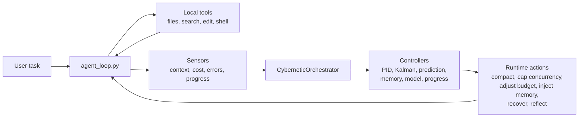

# MiniCode Python

<p align="center">
  <strong>A self-regulating Python coding agent for local development.</strong>
</p>

<p align="center">
  <a href="./README.zh-CN.md">简体中文</a>
  ·
  <a href="https://github.com/LiuMengxuan04/MiniCode">MiniCode Main Repo</a>
  ·
  <a href="https://github.com/QUSETIONS/MiniCode-Python">Python Repo</a>
</p>

<p align="center">
  
  
  
</p>

MiniCode Python is the Python implementation in the MiniCode family. The main
project is [LiuMengxuan04/MiniCode](https://github.com/LiuMengxuan04/MiniCode);
this repository explores a Python-first agent runtime with cybernetic control,
adaptive memory, and a testable local tool loop.

Instead of treating context pressure, tool failures, memory noise, and cost
drift as prompt-only problems, MiniCode Python measures them during execution
and feeds those signals back into runtime decisions.

## Why It Exists

Most coding agents are model wrappers: prompt in, tool calls out, hope the loop
stays healthy. MiniCode Python is built around a different idea:

> a coding agent should observe itself while it works, then adjust its own
> context, memory, verification, concurrency, and recovery behavior.

That makes this repository useful as:

- a local coding-agent implementation you can inspect end to end;
- a Python research bed for agent control, memory, and verification loops;
- a companion implementation to the TypeScript MiniCode main repo;
- a practical place to test ideas before they become larger platform features.

## Highlights

| Area | What MiniCode Python Adds |
| --- | --- |
| Runtime control | `CyberneticOrchestrator` coordinates context, cost, feedback, progress, memory, and recovery controllers. |
| Context management | PID-style context pressure handling, compaction, budget adjustment, and predictive guards. |
| Memory | Domain-aware retrieval, optional LLM reranking, prompt injection, reflection write-back, and maintenance. |
| Tool loop | Local file/search/edit/command tools with scheduler-aware execution and error nudges. |
| Recovery | Self-healing paths for context overflow, tool failures, oscillation, and resource pressure. |
| Verification | Focused unit, integration, stress, and cybernetics tests across the active root package. |

## Architecture



The main loop now drives the orchestrator lifecycle directly:

- `wire_memory()`
- `wire_healing()`
- `inject_memories()`
- `step_start()`
- `step_end()`
- `reflect_on_task()`

This keeps controller initialization, memory injection, per-step observation,
feedback, self-healing, and post-task reflection tied to the same runtime
surface.

## Repository Status

The active package is the root package configured in `pyproject.toml`.

| Path | Role |
| --- | --- |
| `minicode/` | Canonical Python package used by install and tests. |
| `tests/` | Active test suite. |
| `py-src/minicode/` | Compatibility/staging mirror kept aligned for migration work. |
| `docs/OPTIMIZATION_SUMMARY.md` | Full optimization and integration record. |
| `docs/memory_theory.md` | Memory/control theory notes. |

The main TypeScript repository may include this project as
`external/MiniCode-Python`, but this Python package is installed and verified
from this repository root.

## Quick Start

```bash
git clone https://github.com/QUSETIONS/MiniCode-Python.git
cd MiniCode-Python
python -m pip install -e .[dev]
```

Run the CLI:

```bash
minicode-py
```

Or run the module directly:

```bash
python -m minicode.main
```

## Verification

The current root package was verified with:

```bash
python -m compileall -q minicode py-src\minicode tests
pytest -q
```

Latest local result:

```text
738 passed, 2 skipped, 3 warnings
```

The warnings are unregistered `pytest.mark.benchmark` markers in benchmark
tests. They do not indicate failing behavior.

## Core Modules

| Module | Purpose |
| --- | --- |
| `minicode/agent_loop.py` | Main model/tool loop and runtime control integration. |
| `minicode/cybernetic_orchestrator.py` | Facade for controller lifecycle hooks. |
| `minicode/context_cybernetics.py` | Context sensing, PID control, and compaction loop. |
| `minicode/feedback_controller.py` | Outer-loop system-state to control-signal mapping. |
| `minicode/self_healing_engine.py` | Fault detection and recovery delegation. |
| `minicode/memory_pipeline.py` | Unified memory read/inject/write/maintain facade. |
| `minicode/memory_reranker.py` | LLM-backed memory curation. |
| `minicode/domain_classifier.py` | Task and file-domain inference. |
| `minicode/model_registry.py` | Model selection controller. |
| `minicode/progress_controller.py` | Task health and stall detection. |

## MiniCode Family

| Version | Repository | Focus |
| --- | --- | --- |
| TypeScript | [LiuMengxuan04/MiniCode](https://github.com/LiuMengxuan04/MiniCode) | Mainline terminal agent, TUI, MCP, skills, sessions, context controls. |
| Python | [QUSETIONS/MiniCode-Python](https://github.com/QUSETIONS/MiniCode-Python) | Cybernetic Python runtime, memory pipeline, verification-oriented experiments. |
| Rust | [harkerhand/MiniCode-rs](https://github.com/harkerhand/MiniCode-rs/tree/master) | Rust implementation and systems-side experimentation. |
| Java | [hobbescalvin414-tech/minicode4j](https://github.com/hobbescalvin414-tech/minicode4j/tree/feat/default-ts-ui) | Java implementation with a TypeScript-style UI direction. |

## Documentation

- [Optimization Summary](./docs/OPTIMIZATION_SUMMARY.md)
- [Memory Theory](./docs/memory_theory.md)
- [Main MiniCode Repository](https://github.com/LiuMengxuan04/MiniCode)

## Design Principles

- Keep the agent loop inspectable.
- Prefer measured runtime signals over hidden prompt magic.
- Apply bounded actions: compact, cap, adjust, recover, reflect.
- Treat verification and evidence as part of the agent runtime.
- Keep the Python implementation useful as both software and research scaffold.
