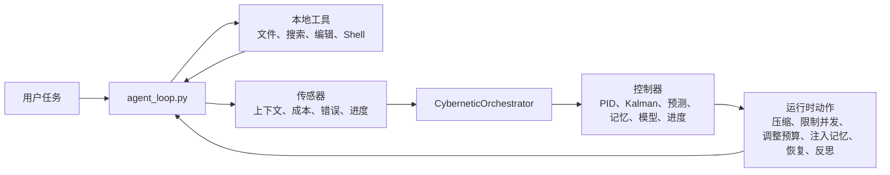

# MiniCode Python

<p align="center">
  <strong>一个具备自我调节能力的 Python 本地编码 Agent。</strong>
</p>

<p align="center">
  <a href="./README.md">English</a>
  ·
  <a href="https://github.com/LiuMengxuan04/MiniCode">MiniCode 主仓库</a>
  ·
  <a href="https://github.com/QUSETIONS/MiniCode-Python">Python 仓库</a>
</p>

<p align="center">
  
  
  
</p>

MiniCode Python 是 MiniCode 家族中的 Python 实现。主项目是
[LiuMengxuan04/MiniCode](https://github.com/LiuMengxuan04/MiniCode)；本仓库负责探索
Python-first 的 Agent 运行时，包括控制论编排、自适应记忆、本地工具循环和可验证实验。

它不是把 LLM 简单包成一个命令行工具，而是把上下文压力、工具失败、记忆噪音和成本漂移都当作可观测信号，再反馈到运行时决策里。

## 为什么做这个版本

很多 Coding Agent 本质上是“模型包装器”：输入 prompt，调用工具，然后希望循环不要坏掉。MiniCode Python 走的是另一条路线：

> 编码 Agent 应该在工作时观察自己，并动态调整上下文、记忆、验证、并发和恢复行为。

因此这个仓库适合用来：

- 阅读一个完整可运行的本地 Coding Agent；
- 研究 Agent 控制、记忆和验证闭环；
- 作为 TypeScript MiniCode 主仓库的 Python 伴随实现；
- 在进入大型平台之前，先验证运行时控制想法。

## 核心亮点

| 方向 | MiniCode Python 提供什么 |
| --- | --- |
| 运行时控制 | `CyberneticOrchestrator` 统一协调上下文、成本、反馈、进度、记忆和恢复控制器。 |
| 上下文管理 | PID 风格的上下文压力处理、压缩、预算调整和预测保护。 |
| 记忆系统 | 领域感知检索、可选 LLM rerank、prompt 注入、任务反思写回和后台维护。 |
| 工具循环 | 本地文件、搜索、编辑、命令工具，支持调度器感知执行和错误提示。 |
| 故障恢复 | 面向上下文溢出、工具失败、振荡和资源压力的自愈路径。 |
| 验证体系 | 覆盖根包的单元测试、集成测试、压力测试和控制论测试。 |

## 架构



主循环现在直接驱动 orchestrator 生命周期：

- `wire_memory()`
- `wire_healing()`
- `inject_memories()`
- `step_start()`
- `step_end()`
- `reflect_on_task()`

这让控制器初始化、记忆注入、逐步观测、反馈、自愈和任务后反思都绑定在同一个运行时表面上。

## 仓库状态

当前有效包是 `pyproject.toml` 配置的根目录包。

| 路径 | 作用 |
| --- | --- |
| `minicode/` | 安装和测试使用的 canonical Python 包。 |
| `tests/` | 当前有效测试套件。 |
| `py-src/minicode/` | 兼容/迁移用镜像目录，会同步关键行为修复。 |
| `docs/OPTIMIZATION_SUMMARY.md` | 完整优化和集成记录。 |
| `docs/memory_theory.md` | 记忆和控制理论说明。 |

TypeScript 主仓库可以把本仓库作为 `external/MiniCode-Python` 关联进来，但 Python 包本身从本仓库根目录安装和验证。

## 快速开始

```bash
git clone https://github.com/QUSETIONS/MiniCode-Python.git
cd MiniCode-Python
python -m pip install -e .[dev]
```

运行 CLI：

```bash
minicode-py
```

或者直接运行模块：

```bash
python -m minicode.main
```

## 验证

当前根包使用以下命令验证：

```bash
python -m compileall -q minicode py-src\minicode tests
pytest -q
```

最近一次本地结果：

```text
738 passed, 2 skipped, 3 warnings
```

这些 warning 来自 benchmark 测试中未注册的 `pytest.mark.benchmark` 标记，不代表行为失败。

## 核心模块

| 模块 | 作用 |
| --- | --- |
| `minicode/agent_loop.py` | 主模型/工具循环和运行时控制集成。 |
| `minicode/cybernetic_orchestrator.py` | 控制器生命周期 facade。 |
| `minicode/context_cybernetics.py` | 上下文感知、PID 控制和压缩循环。 |
| `minicode/feedback_controller.py` | 外环系统状态到控制信号的映射。 |
| `minicode/self_healing_engine.py` | 故障检测和恢复委托。 |
| `minicode/memory_pipeline.py` | 统一的记忆读取、注入、写回和维护接口。 |
| `minicode/memory_reranker.py` | LLM 驱动的记忆策展。 |
| `minicode/domain_classifier.py` | 任务和文件领域推断。 |
| `minicode/model_registry.py` | 模型选择控制器。 |
| `minicode/progress_controller.py` | 任务健康度和卡顿检测。 |

## MiniCode 家族

| 版本 | 仓库 | 重点 |
| --- | --- | --- |
| TypeScript | [LiuMengxuan04/MiniCode](https://github.com/LiuMengxuan04/MiniCode) | 主线终端 Agent、TUI、MCP、Skills、会话和上下文控制。 |
| Python | [QUSETIONS/MiniCode-Python](https://github.com/QUSETIONS/MiniCode-Python) | 控制论 Python 运行时、记忆管线和面向验证的实验。 |
| Rust | [harkerhand/MiniCode-rs](https://github.com/harkerhand/MiniCode-rs/tree/master) | Rust 实现和系统侧实验。 |
| Java | [hobbescalvin414-tech/minicode4j](https://github.com/hobbescalvin414-tech/minicode4j/tree/feat/default-ts-ui) | Java 实现，沿用 TypeScript 风格 UI 方向。 |

## 文档

- [完整优化总结](./docs/OPTIMIZATION_SUMMARY.md)
- [记忆理论说明](./docs/memory_theory.md)
- [MiniCode 主仓库](https://github.com/LiuMengxuan04/MiniCode)

## 设计原则

- 让 Agent 主循环保持可读、可查、可改。
- 优先使用可观测运行时信号，而不是隐藏 prompt 技巧。
- 运行时动作必须有边界：压缩、限流、调预算、恢复、反思。
- 把验证和证据当作 Agent 运行时的一部分。
- 让 Python 实现既能作为软件使用，也能作为研究脚手架。
